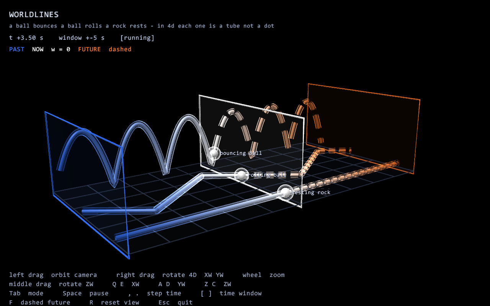
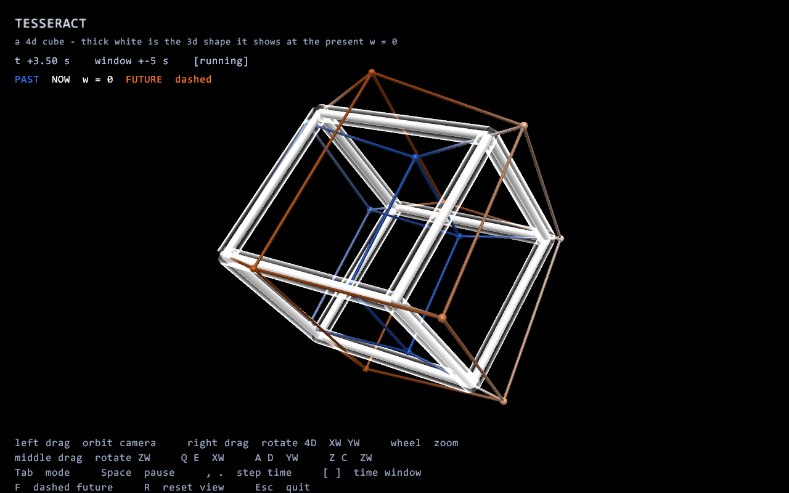
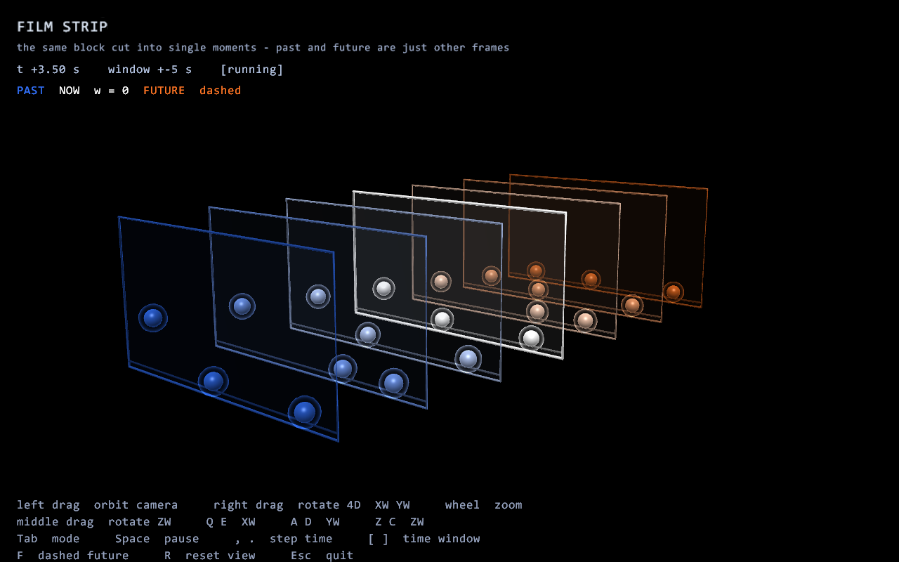

# spacetime4d

Past, present and future drawn at the same time — a real-time 3D view of a 4D
block universe, where the fourth axis is time.

Windows, C++17, OpenGL 3.3 core, **no third-party dependencies at all**: no GLFW,
no GLAD, no GLM, no stb. About 1900 lines, including the GL loader, the mesh
builder and the text renderer.



## What you are looking at

The scene is deliberately mundane: a ball bounces on the floor, another ball
rolls back and forth, a rock sits still. In ordinary 3D that is just motion. In
4D none of them is a point — each one is a **worldline**, a frozen tube stretched
along the time axis.

The shape of the tube tells you what the object did:

| object | worldline |
|---|---|
| resting rock | a straight line along time |
| rolling ball | a straight slope that kinks at every wall bounce |
| bouncing ball | a chain of parabolas |

The floor exists at every moment too, so here it is not a line but a sheet.

Colour encodes time and means the same thing in every mode:

| colour | meaning |
|---|---|
| blue | past, `w < 0` |
| white | the present, the hyperplane `w = 0` |
| orange, dashed | future, `w > 0` — dashed because it is a prediction |

## Modes

### 1. Worldlines

The main view. Three translucent frames are three complete 3D slices: the world
five seconds ago, right now, and five seconds ahead. The worldlines run between
them.

The point: nothing moves here. There is one frozen 4D shape, and what we call
"now" is just a single cross-section of it.

### 2. Tesseract



A 4D cube spinning in the XW, YZ and ZW planes. Thin edges are tinted by their
own `w` coordinate, so part of the cube lies in the past and part in the future.
The thick white tubes are its cross-section with the hyperplane `w = 0` — exactly
the 3D polyhedron an inhabitant of the present would see. The cross-section keeps
reshaping itself even though the tesseract itself never changes.

### 3. Film strip



The same block cut into separate instants: seven frames in a row, from the blue
past through the white present to the orange future. Time as a reel of film, and
"now" is just the frame currently in the projector.

Modes 1 and 3 show the same thing — in the film strip the frames are separate, in
the worldlines view those frames are glued into continuous tubes.

## Build

```bat
build.bat
```

The script locates MSVC (Visual Studio Build Tools) or MinGW on its own. Or with
CMake:

```bat
cmake -B build -S . && cmake --build build --config Release
```

Both MSVC (`/W4`) and GCC (`-Wall -Wextra`) build warning-free. Needs Windows and
a GPU with OpenGL 3.3.

## Run

```bat
spacetime4d-gl.exe
```

Command line flags, mostly for taking screenshots:

| flag | meaning |
|---|---|
| `--mode 0` `1` `2` | start in worldlines, tesseract or film strip |
| `--time T` | start at time T |
| `--shot out.bmp` | render one frame to a file and exit |

## Controls

| input | action |
|---|---|
| left drag | orbit the 3D camera |
| right drag | rotate in 4D: horizontal is the XW plane, vertical is YW |
| middle drag | rotate in the ZW plane |
| wheel | zoom |
| `Q` / `E` | rotate the XW plane |
| `A` / `D` | rotate the YW plane |
| `Z` / `C` | rotate the ZW plane |
| `Tab`, `1` `2` `3` | switch mode |
| `Space` | pause |
| `,` `.` | step time by hand |
| `[` `]` | time window |
| `F` | toggle the dashed future |
| `R` | reset the view |
| `Esc` | quit |

The 4D rotations are the interesting part. They mix space and time: what was time
turns into space and back. A 4D space has six independent rotation planes, not
three.

Note the difference between the mouse buttons. The left button moves an ordinary
3D camera around an already-built shape. The right button changes the shape
itself, because it changes how 4D is folded down into 3D.

## How it works

| file | contents |
|---|---|
| `src/math4d.h` | `Vec3`, `Vec4`, the six rotation planes of `Rot4`, matrices, the 4D→3D lens |
| `src/glcore.h/.cpp` | a small OpenGL 3.3 entry point loader |
| `src/gfx.h/.cpp` | shaders, tube and sphere builders, GPU buffers |
| `src/text.h/.cpp` | font atlas baked from Consolas through GDI at startup |
| `src/scene.h/.cpp` | worldlines, tesseract, film strip |
| `src/main.cpp` | window, WGL context, main loop, input, HUD |

**Geometry is rebuilt on the CPU every frame.** Points are defined in 4D,
projected to 3D, and only then turned into a tube with real normals. That is why
worldlines are lit like solid bodies instead of being drawn as lines. Tube rings
are carried along the path by parallel transport, otherwise the tube twists at
every turn.

**The 4D→3D lens differs per mode.** In the worldline modes the 4D eye distance
is deliberately huge, so the projection is nearly orthographic and time reads as
a straight axis. A tesseract needs the opposite — strong 4D perspective, or it
stops looking like nested cubes. Each mode carries its own lens and camera.

**The tesseract cross-section is computed honestly.** All 24 square faces are
enumerated, each is intersected with the hyperplane `w = 0`, and the two
resulting points give one segment of the section.

**The glow needs no post-processing.** Every tube is drawn a second time, twice
as thick, blended additively, with its alpha falling off toward the centre by a
Fresnel term. The halo lands around the silhouette — cheap, and no framebuffer
objects involved.

**Context creation goes through a throwaway window.** A plain WGL context first,
only to reach `wglChoosePixelFormatARB` and `wglCreateContextAttribsARB`, then
the real window with 4x MSAA and a 3.3 core profile.

## Same thing in a terminal

An earlier ASCII version renders the same three ideas into a text console with a
depth buffer and truecolour escape codes. Not included here.
